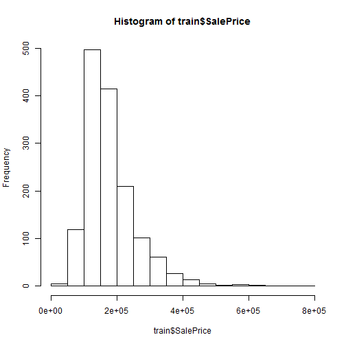
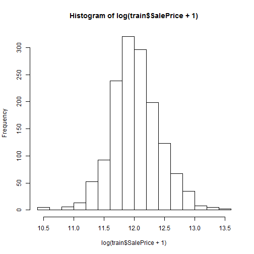
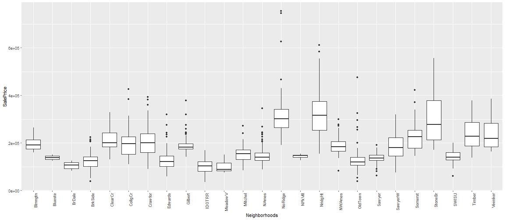
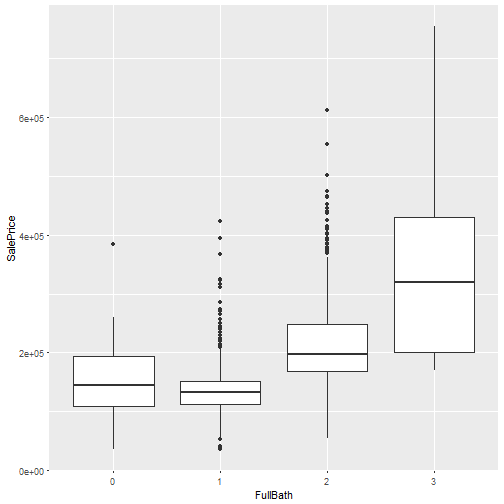
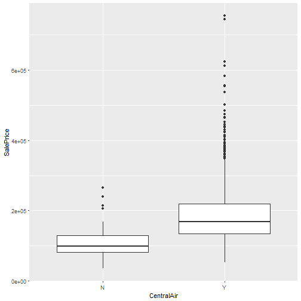

PREDICT 413 Final: Ames Housing Prices
========================================================
author: Kevin Wong
date: Fall 2016 
width:1440
height: 900


Project Topics
========================================================

- Problem
- EDA
- Data Prep
- Models
- Results
- Conclusion


Problem
========================================================

- Predict housing prices on Kaggle given a train and test set
- Predictions are evaluated using the log of the RMSE
- Dataset contains a mix of 80+ numeric and categorical variables

EDA
========================================================
Distribution of SalePrice  


EDA Cont'd
========================================================
Neighborhoods and SalePrice  



EDA Cont'd
========================================================
Other features and SalePrice  


EDA Cont'd
========================================================

```r
library(caret)
nzv <- nearZeroVar(train)
colnames(train[nzv])
```

```
 [1] "Street"        "LandContour"   "Utilities"     "LandSlope"    
 [5] "Condition2"    "RoofMatl"      "BsmtCond"      "BsmtFinType2" 
 [9] "BsmtFinSF2"    "Heating"       "LowQualFinSF"  "KitchenAbvGr" 
[13] "Functional"    "GarageQual"    "GarageCond"    "EnclosedPorch"
[17] "X3SsnPorch"    "ScreenPorch"   "PoolArea"      "MiscVal"      
```


Data Prep
========================================================

- Variables with high number of NAs were removed (>200)
- Variables with near zero variance were removed 
- Missing values were imputed using the *mice* package
- SalePrice variable was transformed using log+1
- Skewed numeric variables greater 0.75 were transformed using log+1
- Categorical variables were one hot encoded as binary variables


Models
========================================================

- Models were fit using the *caret* and *h2o* packages
- Five types of models:
    - LASSO
    - Random Forest
    - GBM
    - Neural network
    - Ensemble (Average of GLM+GBM)


Model Formulation
========================================================
Caret method  

```r
fitControl <- trainControl(method="repeatedcv", number=5, repeats=5, 
                           verboseIter=FALSE)
lambdas <- c(1,0.1,0.05,0.01,seq(0.009,0.001,-0.001), 0.00075,0.0005,0.0001)))

set.seed(123)
lasso_mod <- train(x=x_train,y=y_train, method="glmnet", metric="RMSE", 
                   maximize=FALSE, trControl=fitControl, 
                   tuneGrid=expand.grid(alpha=1, lambda=lambdas)
```

h2o method  

```r
dl_fit <- h2o.deeplearning(x = x, y = y, training_frame = train_h2o, 
                           model_id = "dl_fit2", epochs = 20, 
                           hidden= c(10,10), seed = 1)

dl_perf <- h2o.performance(model = dl_fit2, newdata = valid_h2o)
```


Results
========================================================

Model |Cross Validation Log RMSE | Kaggle Public Log RMSE
-------|--------------------|-------------------
LASSO | 0.12783 | 0.12390
Random Forest | 0.12567 | 0.14043
GBM | 0.12382 | 0.13733
Neural Network | 0.14334 | 0.16168
Ensemble (GLM+GBM) | 0.10757 | 0.12523


Conclusions/Considerations
========================================================

- Simpler models can be better / Complex models can be worse
- Perform additional feature engineering
- Handle outliers
- Explore other dimension reduction techniques like PCA, Factor Analysis, etc.

